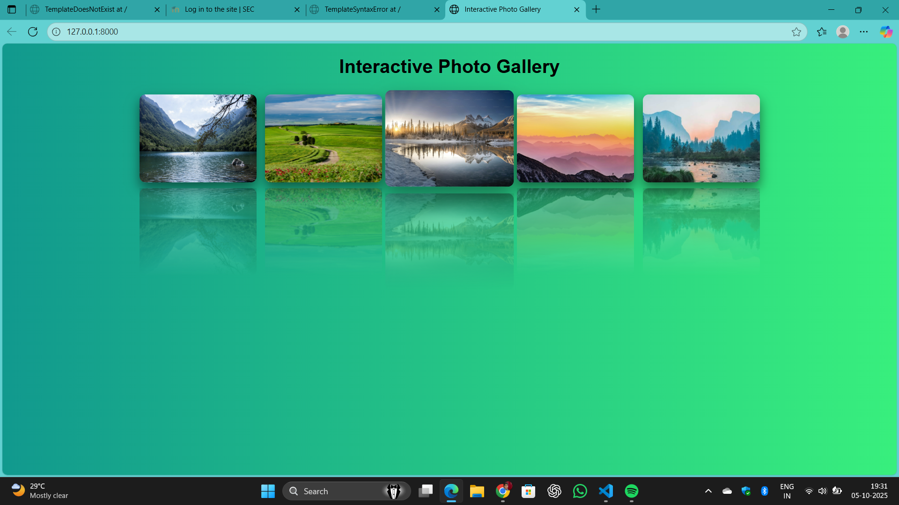

# Ex.08 Design of Interactive Image Gallery
# Date:05-10-2025
# AIM:
To design a web application for an inteactive image gallery with minimum five images.

# DESIGN STEPS:
## Step 1:
Clone the github repository and create Django admin interface.

## Step 2:
Change settings.py file to allow request from all hosts.

## Step 3:
Use CSS for positioning and styling.

## Step 4:
Write JavaScript program for implementing interactivity.

## Step 5:
Validate the HTML and CSS code.

## Step 6:
Publish the website in the given URL.

# PROGRAM :
style.css
```
body {
    font-family: Arial;
    text-align: center;
    background: linear-gradient(to right, #e0f7fa, #fff);
}

.gallery {
    display: flex;
    flex-wrap: wrap;
    justify-content: center;
    gap: 15px;
    margin-top: 30px;
}

.gallery-img {
    width: 200px;
    height: 150px;
    border-radius: 10px;
    cursor: pointer;
    transition: transform 0.5s;
    box-shadow: 0 10px 20px rgba(0,0,0,0.5);
    -webkit-box-reflect: below 10px linear-gradient(transparent, rgba(255,255,255,0.4));
}


.modal {
    display: none;
    position: fixed;
    z-index: 1;
    padding-top: 80px;
    left: 0;
    top: 0;
    width: 100%;
    height: 100%;
    background: rgba(0,0,0,0.8);
}

.modal img {
    margin: auto;
    display: block;
    max-width: 80%;
    border-radius: 10px;
}
body {
    font-family: Arial;
    text-align: center;
   
    background: linear-gradient(to right, #11998e, #38ef7d);


    

}
.gallery-img:hover {
    transform: scale(1.1);
    box-shadow: 0 15px 30px rgba(0, 0, 0, 0.4);
}

```
script.js
```
function openModal(img) {
    var modal = document.getElementById("modal");
    var modalImg = document.getElementById("modalImg");
    modal.style.display = "block";
    modalImg.src = img.src;
}

function closeModal() {
    document.getElementById("modal").style.display = "none";
}

```
gallery.html
```
<!DOCTYPE html>
<html lang="en">
<head>
    
    <meta charset="UTF-8">
    <title>Interactive Photo Gallery</title>
    <link rel="stylesheet" href="">
</head>
<body>
    <h1>Interactive Photo Gallery</h1>
    <div class="gallery">
        
        
        
    </div>


    <div id="modal" class="modal" onclick="closeModal()">
        
    </div>

    <script src=""></script>
</body>
</html>

```
views.py
```
from django.shortcuts import render

def gallery_view(request):
    images = [
        {'src': 'gallery/img1.png', 'alt': 'Image 1'},
        {'src': 'gallery/img2.png', 'alt': 'Image 2'},
        {'src': 'gallery/img3.png', 'alt': 'Image 3'},
        {'src': 'gallery/img4.png', 'alt': 'Image 4'},
        {'src': 'gallery/img5.png', 'alt': 'Image 5'},
    ]
    return render(request, 'gallery.html', {'images': images})

```
urls.py
```
from django.contrib import admin
from django.urls import path
from gallery import views

urlpatterns = [
    path('admin/', admin.site.urls),
    path('',views.gallery_view)
    
]
```
# OUTPUT:

# RESULT:
The program for designing an interactive image gallery using HTML, CSS and JavaScript is executed successfully.
